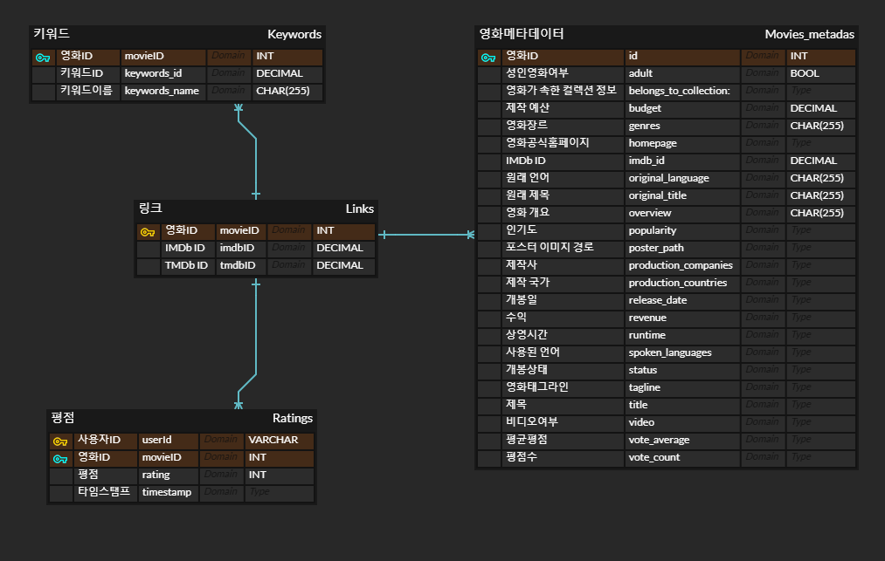

# Movie Dataset Analysis 🎬

> Kaggle "The Movies Dataset"을 활용한 다양한 인사이트 도출 프로젝트


## 📖 Description
```markdown
프로젝트는 Kaggle의 "The Movies Dataset"을 활용하여 팀원 각자가 설정한 분석 주제에 따라 다양한 인사이트를 도출하는 것을 목표로 하였습니다. 
팀원들은 각자의 분석 결과를 바탕으로 서로 피드백을 주고받으며 데이터 분석 능력을 향상시키고, 영화 산업에 대한 다양한 통찰을 공유하였습니다. 
이 과정에서 데이터 전처리, 탐색적 데이터 분석, 시각화, 모델링 등 다양한 분석 기법을 적용하여 영화 데이터에 숨겨진 패턴과 트렌드를 파악하였습니다.
```

## 🗄️ Dataset
👉 [Kaggle "The Movies Dataset"](https://www.kaggle.com/datasets/rounakbanik/the-movies-dataset?select=keywords.csv)

## 🔧 Stack

|<center>VScode</center>|<center>Colab</center>|<center>Python</center>|<center>Kaggle</center>|<center>Pandas</center>|<center>Sklearn</center>|<center>Matplotlib</center>|<center>Seaborn</center>|
|--|--|--|--|--|--|--|--|
|<p align="center"></p>|<p align="center"></p>|<p align="center"></p>|<p align="center"></p>|<p align="center"></p>|<p align="center"></p>|<p align="center"></p>|<p align="center"></p>|
|||||||||

## 📂 Directory Structure

```markdown
Movie-Dataset_Analysis_Project
├── icons/
├── data_analysis/
│   ├── Chang/
│   │     ├── Analysis_Files/
│   │     │         ├── Movie_Data_DDA.ipynb
│   │     │         ├── Movie_data_practice.ipynb
│   │     │         ├── The_Story_of_Film_07_30.ipynb
│   │     │         └── The_Story_of_Film_07_31.ipynb
│   │     └── PDF/
│   │          ├── analysis_direction.pdf
│   │          ├── Movie_Dataset.pdf
│   │          └── split_process.pdf
│   ├── Dongwoo/
│   │       └── SESAC_MiniProject.ipynb
│   ├── hyunji_Ham/
│   │       └── Analysis_of_Movie_Data_by_Period.ipynb
│   ├── MJ/
│   │    ├── Movie_dataset_EDA_MJ.ipynb
│   │    ├── Movie_Rating_Prediction.ipynb
│   │    ├── 데이터분석_소주제.pdf
│   │    └── 데이터셋과 column별 분석주제.pdf
│   ├── soyounPark/
│   │    └── 영화데이터셋분석_미니프로젝트(박소연).ipynb
│   └── yugyeong
│         ├── DDA_YG_The Movies Dataset.ipynb
│         ├── EDA_YG_KeywordVoteavg.ipynb
│         ├── CDA_YG_KeywordRatings.ipynb
│         └── PDA_YG_Modeling.ipynb
├── dataset
│   ├── archive/
│   │     ├── keywords.xlsx
│   │     ├── links.xlsx
│   │     └── movies_metadata.xlsx
│   └── dictdata_modify.ipynb
├── dummy_file
│      ├── idea/
│      ├── analysis_direction.pdf
│      ├── ERD.png
│      ├── Movie_Dataset.pdf
│      ├── movies_metadata.csv.txt
│      └── split_process.pdf
└── presentation
       ├── Analysis of Movie Data by Period_hyunji.pdf
       ├── Chang_Movies_Data_PPT.pdf
       ├── SESAC MiniProject-DongWoo.pdf.pdf
       ├── SeSAC_Movie_data_anlaysis_MJ.pdf
       ├── SeSAC_Movie_data_anlaysis_soyoun.pdf.pdf
       └── SeSAC-MiniProject_yugyeongjo.pdf
```

## 📊 ERD


## 👨‍👩‍👧‍👦 Team member
|이름|역할|분석주제|분석결과|Github|
|--|--|--|--|--|
|**김민진**|분석|제작사 중심 영화 흥행 요인 분석|[PPT](./presentation/SeSAC_Movie_data_anlaysis_MJ.pdf)|[Click!](https://github.com/mjxxkxx)|
|**조유경**|분석 및 모델링|영화 키워드와 영화 평점간의 상관관계 분석 <br> 평점 예측 모델 제작|[PPT](./presentation/SeSAC-MiniProject_yugyeongjo.pdf)|[Click!](https://github.com/YugyeongJo)|
|**박창현**|분석|제작사 중심 영화 흥행 요인 분석|[PPT](./presentation/Chang_Movies_Data_PPT.pdf)|[Click!](https://github.com/Chang-Hyeon-Park)|
|**한동우**|분석|영화 산업의 시대별 변화와 트렌드 분석|[PPT](./presentation/SESAC%20MiniProject-DongWoo.pdf.pdf)|[Click!](https://github.com/DongwooHan-GitHub)|
|**박소연**|분석|영화 인기도에 영향을 미치는 요인 분석|[PPT](./presentation/SeSAC_Movie_data_anlaysis_soyoun.pdf.pdf)|[Click!](https://github.com/amnyday)|
|**함현지**|분석|영화 개봉 전략을 위한 인기도 및 시기 분석|[PPT](./presentation/Analysis%20of%20Movie%20Data%20by%20Period_hyunji.pdf)|[Click!](https://github.com/rmfpafls)|
